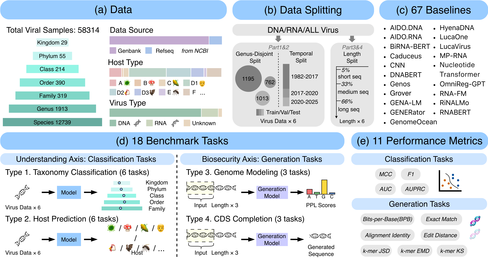

# ViroBench: Viral Understanding & Safety Benchmark for Nucleotide Foundation Models

[](https://huggingface.co/datasets/YDXX/ViroBench) [](https://www.modelscope.cn/datasets/YDDDDD0/ViroBench) [](https://huggingface.co/datasets/YDXX/ViroBlend)

[](https://huggingface.co/YDXX/ViroHyena-436k) [](https://huggingface.co/YDXX/ViroHyena-1m) [](https://huggingface.co/YDXX/ViroHyena-6m) [](https://huggingface.co/YDXX/ViroHyena-253m)



**ViroBench** is a dual-axis diagnostic benchmark for **viral sequence modeling**, designed to evaluate both:
- **Understanding Axis**: taxonomy classification & host prediction
- **Biosecurity Axis**: genome modeling & CDS completion (risk-aware generation diagnostics)

**Key stats**
- **58,314** viral samples curated from **NCBI** (GenBank + RefSeq), spanning **DNA / RNA / Unknown** nucleic-acid types  
- **18 benchmark tasks**: 12 classification + 6 generation  
- **67 baselines** across diverse architectures & tokenizers  
- **11 metrics** covering both classification quality and generation fidelity

This repository provides a unified, reproducible evaluation pipeline and diagnostic protocols for viral nucleotide foundation models (NFMs).

---

## 🔥 Highlights

- **Two stringent split axes for realistic generalization**
  - **Genus-disjoint split** to reduce phylogenetic leakage  
  - **Temporal split** to evaluate distribution drift across newly appearing variants

- **Length-bucketed generation diagnostics**
  - **Genome modeling** (3 tasks): short / medium / long buckets
  - **CDS completion** (3 tasks): short / medium / long buckets  
  - Designed to reveal capability degradation and elevated risk signals under long-range constraints

- **Unified protocol**
  - Frozen backbone encoder + lightweight supervised head (for classification)
  - Standardized metrics for likelihood modeling and constrained sequence completion

---

## 📌 Benchmark Suite

### 1) Understanding Axis: Classification Tasks (12 tasks)

**Targets**
- **Taxonomy classification** at multiple phylogenetic levels:
  - Kingdom, Phylum, Class, Order, Family (**6 tasks total across DNA/RNA/ALL settings**)
- **Host prediction** (**6 tasks total across DNA/RNA/ALL settings**)

**Split strategies**
- **Genus-disjoint** (no genus overlap across train/val/test)
- **Temporal** (split by record time to capture drift)
- All variants use **8:1:1** train/val/test ratio

**Metrics**
- MCC, ACC, AUROC, F1, AUPRC

---

### 2) Biosecurity Axis: Generation Tasks (6 tasks)

#### (a) Genome Modeling (3 tasks)
- Evaluate likelihood-based modeling using **BPB (bits-per-base)** as the primary metric  
- Length bucketing uses quantile-based bins:
  - short (5%–33%), medium (33%–66%), long (66%–100%)

#### (b) CDS Completion (3 tasks)
- CDS continuation under functional constraints (e.g., coding validity, frame consistency)
- Metrics include:
  - **Sequence similarity**: alignment identity, edit distance, exact match accuracy
  - **Distributional fidelity**: k-mer EMD / JSD / KS
  - **CDS Success Rate (CSR)**: whether the completed sequence satisfies predefined CDS validity constraints

---

## 🧬 Data

### Dataset Overview
- Source: **NCBI viral records** (GenBank + RefSeq)
- Scale: **58,314** viral samples
- Labels:
  - hierarchical taxonomy annotations (Kingdom 、 Phylum 、 Class 、 Order 、 Family)
  - multiple host categories (**A–F**, with **D1–D3** as sub-categories)
  - nucleic-acid types: **DNA / RNA / Unknown**


---

## 🧩 Models & Unified Evaluation Protocol

### Classification: Frozen Encoder + Lightweight Head
We adopt a unified evaluation protocol where the **backbone is frozen** and only a **lightweight head** is trained:
1) extract a sequence-level embedding (pooling depends on model, e.g., final/mean/CLS)
2) train a supervised MLP head on top of embeddings
3) evaluate under genus-disjoint and temporal splits

### Baselines (67 models)
The benchmark includes NFMs and conventional baselines (e.g., CNN) across diverse design families and tokenization strategies.

---

## ⚙️ Installation


### Environment setup
```bash
git clone https://github.com/QIANJINYDX/ViroBench
cd ViroBench
```
For model-specific setup (e.g. Evo2, HyenaDNA), please refer to each model’s official documentation.

---

## 🚀 Quickstart

### 1) Prepare data
Data is provided under `data/all_viral/`: classification splits in `data/all_viral/cls_data/`, generation data in `data/all_viral/gen_data/` (e.g. `genome_gen/`, CDS buckets). Adjust paths in the scripts if you use a custom layout.

### 2) Run classification benchmark
```bash
# Example: genus-disjoint taxonomy (all NA types)
python script/run_all.py \
  --model_name evo2_1b_base \
  --dataset_name ALL-taxon-genus

# Other tasks: DNA-taxon-genus, RNA-host-times, ALL-host-genus, etc.
# Format: {DNA|RNA|ALL}-{taxon|host}-{genus|times}
```

### 3) Run generation diagnostics

**Genome modeling (BPB)**  
```bash
python script/run_all_ppl.py \
  --model_name evo2_1b_base \
  --dataset_name genome-long
# Buckets: genome-short, genome-medium, genome-long
```

**CDS completion (k-mer + similarity + CSR)**  
```bash
python script/run_all_gen.py \
  --model_name evo2_1b_base \
  --dataset_name cds-medium
# Buckets: cds-short, cds-medium, cds-long
```

---

## ➕ Add Your Model
To add a new model, implement:

- **`encode()`**: maps input sequence → fixed-dimensional embedding (for classification).
- **`generate()` / `score()`**: support generation (CDS completion) and/or likelihood scoring (genome modeling).

Then wire the model in the codebase (e.g. in `script/run_all.py`, `script/run_all_gen.py`, `script/run_all_ppl.py` and in `models/`) so the pipeline can run it across tasks and splits consistently.

---

## 📊 Reproducibility
- Fixed task manifests, consistent split protocols, and standardized metrics.
- Record: environment (CUDA/PyTorch versions), seeds, model checkpoint versions, runtime/hardware (GPU type).
- Recommended: push complete result matrices to `results/tables/` and generate plots in `results/figures/`.

---

## 🛡️ Biosecurity & Responsible Use
This benchmark includes generation diagnostics intended for risk measurement and model safety research.

- **Do NOT** use this repository to design, optimize, synthesize, or operationalize harmful biological agents.
- Follow all applicable laws, institutional policies, and biosafety regulations.
- If you release checkpoints or generation outputs, consider controlled access and red-teaming protocols.
